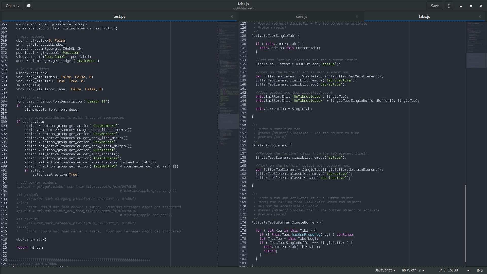

# One dark theme for Gedit / Gtksourceview

This gtk color scheme has been automatically generated from [digitalpardo's One-Dark textmate theme](https://github.com/digitalpardoe/One-Dark.tmbundle/) using [tm2gtksw2](https://github.com/lexrupy/tm2gtksw2).

## Installing

First, close gedit. Then open a terminal and

```bash
cd /tmp
git clone https://github.com/isdampe/gedit-gtk-one-dark-style-scheme
cp gedit-gtk-one-dark-style-scheme/*.xml ~/.local/share/gtksourceview-3.0/styles/
```

You are now done.

## Screenshot


